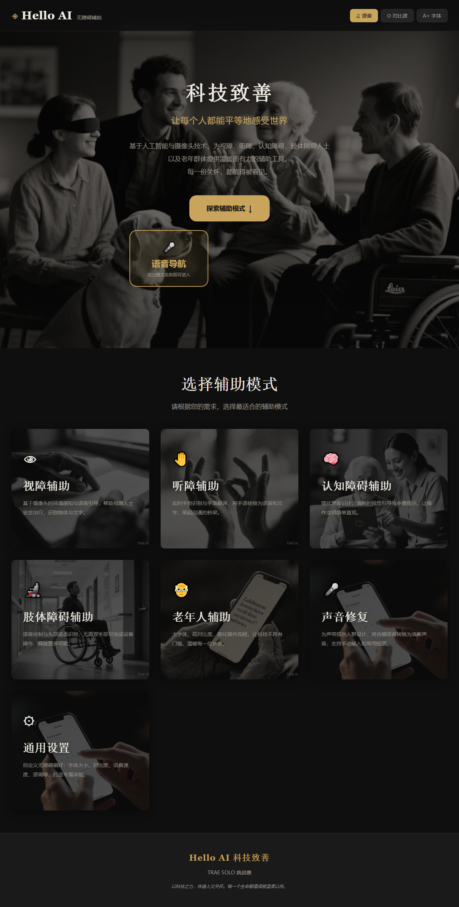
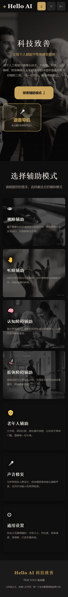
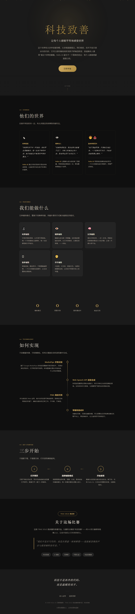
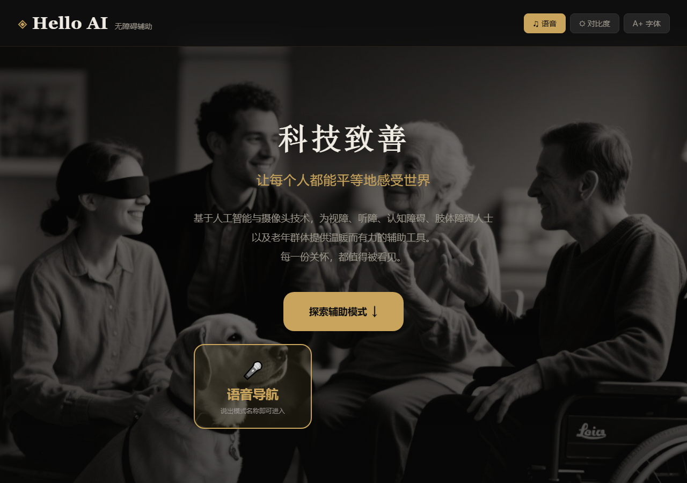
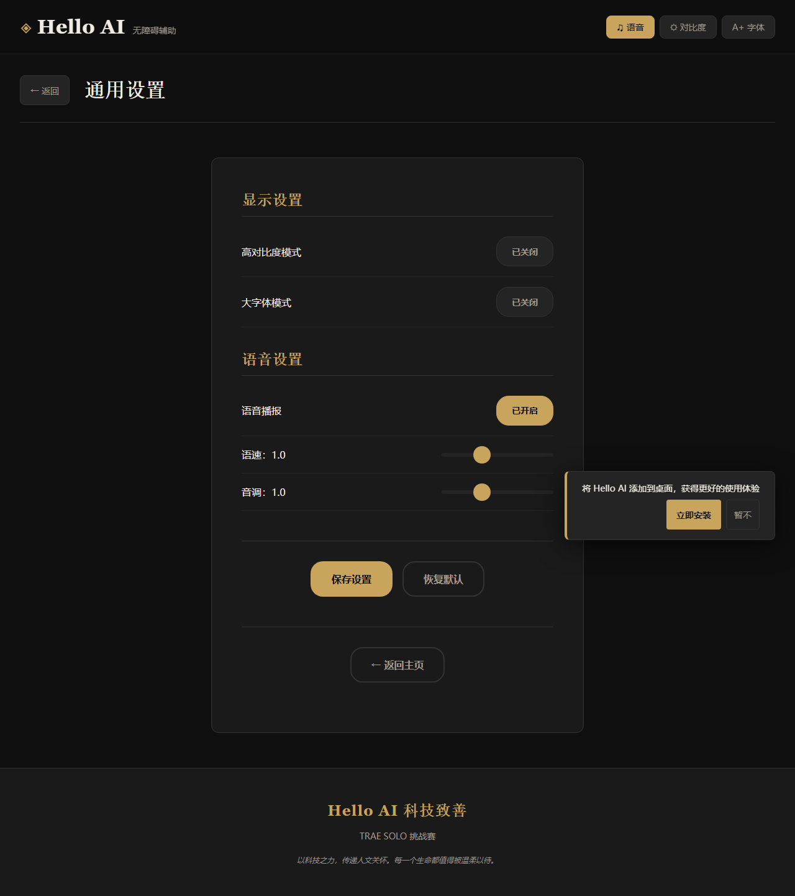

【Hello AI 科技致善】用 SOLO 打造五合一无障碍辅助工具，让每位残障人士都有 AI 搭档

---

## ① 摘要

面向听障、视障、认知障碍、肢体障碍人士及老年群体，在日常生活中提供摄像头感知、手势翻译、步骤引导、语音控制等核心能力，目前通过本地部署验证了全部五个辅助模式的功能可用性。

---

## ② 真实场景与需求

### 目标人群

视障、听障、认知障碍、肢体障碍人士及老年群体 — 中国有超过 8500 万残障人士，加上老年人口，无障碍需求覆盖数亿人。

### 痛点描述

- **听障人士**：手语是他们的母语，但大多数健听人看不懂手语，日常沟通存在巨大障碍。去医院看病，无法与医生沟通症状；去银行办事，无法表达需求。
- **视障人士**：出行时无法感知前方障碍物、无法识别物体颜色和文字，依赖导盲犬或他人帮助。独自在家时，无法分辨药品、感知环境。
- **认知障碍人士**：面对多步骤任务（如做饭、出门）容易混乱，需要清晰的步骤引导。
- **肢体障碍人士**：无法使用双手操作手机，需要语音控制等替代交互方式。
- **老年人**：字体太小看不清、操作太复杂不会用、紧急情况无法快速求助。

### 现有做法及不足

- 专业辅助设备价格高昂（如导盲设备数千元），普通家庭难以承受
- 手语翻译服务稀缺且昂贵，日常场景无法随时使用
- 现有辅助 App 功能单一，往往只覆盖一种障碍类型
- 很多辅助工具操作复杂，反而增加了使用门槛

---

## ③ 作品介绍

**Hello AI 无障碍辅助** 是一个基于 Web 的五合一智能辅助工具，通过浏览器即可使用，无需安装任何 App。

### 核心功能

| 模式 | 功能 | 技术 |
|------|------|------|
| 听障辅助 | 手势识别转语音文字、手语训练、自定义词汇 | MediaPipe Gesture Recognizer + KNN 分类器 |
| 视障辅助 | 环境感知、颜色识别、障碍检测、紧急求助、手势控制 | MediaPipe 手势识别 + Canvas 图像分析 |
| 认知辅助 | 步骤引导、自定义工作流程、大字体高对比度 | 语音播报 + 本地存储 |
| 肢体辅助 | 语音命令控制、免手动操作 | Web Speech Recognition API |
| 老年辅助 | 大按钮简化界面、吃药提醒、一键求助 | 语音合成 + 本地存储 |

### 无障碍设计

- 跳过导航链接、ARIA 标签、键盘完全可操作
- 高对比度模式、大字体模式
- 语音播报全程伴随
- PWA 支持离线使用
- 响应式设计，手机端深度适配

---

## ④ 用 SOLO 实现的过程

### 任务拆解

整个项目用 TRAE SOLO 从零开始构建，我是独立开发者，一个人完成了全部设计和开发。

**第一阶段：基础架构搭建**
- 用 SOLO 生成项目骨架：HTML 结构、CSS 设计系统、JS 模块架构
- 设计了莱卡黑白摄影 + 暖金色点缀的视觉风格
- 建立了 CSS 变量体系（设计令牌），支持主题切换

**第二阶段：五个辅助模式开发**
- 逐个模式开发：先写 HTML 模板，再实现 JS 逻辑
- 每个模式独立模块化，互不干扰
- SOLO 帮助快速生成了大量的 DOM 操作代码和事件处理逻辑

**第三阶段：AI 能力集成**
- 集成 MediaPipe Tasks Vision 实现手势识别
- 实现 KNN 分类器支持自定义手语训练
- 用 Web Speech API 实现语音识别和语音合成

**第四阶段：优化与打磨**
- 手机端适配：安全区域、触摸优化、摄像头切换
- PWA 支持：Service Worker、离线缓存、安装提示
- 无障碍增强：ARIA 标签、键盘操作、焦点管理

### 用到的 SOLO 能力

| 能力 | 应用 |
|------|------|
| 代码编写 | 3000+ 行 JavaScript，12 个模块 |
| 代码调试 | 修复 10+ 个高严重度 bug（内存泄漏、XSS、兼容性等） |
| 代码重构 | app.js 拆分为模块化架构 |
| Web 搜索 | 调研手语数据集、PWA 最佳实践 |
| 文件生成 | SVG 图标、README、LICENSE、提交帖 |

### 关键 Prompt 示例

```
帮我实现一个视障辅助模块，需要：
1. 摄像头实时感知环境亮度和颜色
2. 帧差法检测障碍物
3. 手势控制（大拇指=确认，握拳=返回）
4. 紧急求助功能（获取GPS位置并生成求助信息）
```

```
优化手机端体验：
1. 摄像头在手机端使用后置摄像头（视障模式）
2. 所有按钮最小触摸区域 48px
3. 底部操作栏固定在屏幕底部
4. 适配刘海屏和底部横条
```

### 踩过的坑

1. **MediaPipe WASM 加载**：CDN 在国内不稳定，改为本地文件 + CDN 回退方案
2. **手机端语音解锁**：iOS/Android 要求用户交互后才能播放语音，加入了点击解锁机制
3. **手势识别性能**：手机端 GPU 不稳定，自动降级到 CPU 模式
4. **手语训练数据**：IndexedDB 版本升级时旧数据残留，加入版本号自动清除机制
5. **KNN 阈值问题**：距离阈值 2.0 太严格，导致所有结果被过滤；后改为置信度阈值
6. **双重 KNN 覆盖**：两个地方同时做 KNN 分类，互相覆盖结果
7. **标准手势误识别**：MediaPipe 把各种手势误识别为 Open_Palm
8. **ES Module 作用域**：拆分模块后 $ 函数在模块中不可用

---

## ⑤ 成果展示

### 在线体验

项目是一个纯前端 Web 应用，可通过以下方式体验：

1. **在线演示**：https://hello-ai.netlify.app/
2. **落地页**：https://hello-ai.netlify.app/landing/
3. **本地运行**：下载项目后执行 `python -m http.server 8080`，浏览器打开 `http://localhost:8080`
4. **手机体验**：同一 WiFi 下访问 `http://[电脑IP]:8080`

### 项目结构

```
hello-ai-accessibility/
├── index.html              # 主页面（含完整无障碍标记）
├── css/style.css           # 样式（莱卡风格 + 响应式 + 无障碍）
├── js/
│   ├── app.js              # 主应用逻辑 + 模块注册
│   ├── modules/
│   │   ├── blind.js        # 视障辅助（768行）
│   │   ├── deaf.js         # 听障辅助（675行）
│   │   ├── cognitive.js    # 认知障碍辅助（含自定义工作流程）
│   │   ├── physical.js     # 肢体障碍辅助
│   │   └── elderly.js      # 老年人辅助
│   ├── managers/
│   │   ├── camera.js       # 摄像头管理
│   │   ├── speech.js       # 语音播报管理
│   │   ├── toast.js        # 通知提示
│   │   └── settings.js     # 设置管理
│   └── utils/
│       ├── dom.js               # 共享 DOM 与图像工具
│       ├── feature-extractor.js # 手部特征提取
│       ├── gesture-recognizer.js # 动态手势识别器
│       ├── sign-classifier.js   # KNN 手语分类器
│       └── data-adapter.js      # 数据适配器（支持vivo格式）
├── libs/mediapipe/          # MediaPipe 本地文件
├── landing/
│   └── index.html           # 产品落地页
├── manifest.json            # PWA 配置
└── sw.js                    # Service Worker
```

### 技术亮点

- **纯浏览器端 AI**：MediaPipe WASM 在浏览器中运行手势识别，无需后端
- **零依赖架构**：纯原生 JS，无 React/Vue 等框架，加载快
- **PWA 离线可用**：三级缓存策略，首次加载后可离线使用
- **动态手势识别**：追踪 15 帧手势轨迹，32 种预置动态手势模板
- **KNN 自定义训练**：用户可训练自定义手语词汇，IndexedDB 持久化
- **回声防止机制**：语音播报时自动暂停语音识别

### 功能截图

**主页界面（桌面端）**


**主页界面（手机端）**


**产品落地页**


**辅助模式选择**


**无障碍设置页面**


---

## ⑥ 验证方式与下一步

### 已验证

- ✅ 5 个模式均可正常进入和退出
- ✅ 手势识别可识别 32 种预置手势
- ✅ 语音播报功能正常
- ✅ 摄像头前后切换正常
- ✅ PWA 可安装到桌面
- ✅ 离线模式可打开页面
- ✅ 手机端响应式布局正常
- ✅ 13 个 JS 文件语法检查全部通过
- ✅ 全部资源文件（CSS/JS/图片/MediaPipe）HTTP 200 正常加载
- ✅ 高对比度/大字体模式切换正常

### 下一步计划

1. **用户测试**：邀请残障朋友试用，收集真实反馈
2. **功能深化**：支持更多手语词汇、优化障碍检测算法
3. **数据接入**：接入 vivo 手语训练数据，提升识别准确率
4. **社区合作**：与残障公益组织合作，推动实际落地

---

*本作品由独立开发者使用 TRAE SOLO 全程开发完成。*

**在线体验**：https://hello-ai.netlify.app/
**落地页**：https://hello-ai.netlify.app/landing/