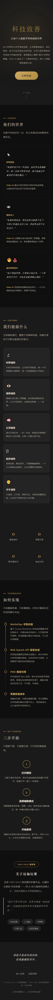

【Hello AI 科技致善】用 SOLO 打造五合一无障碍辅助工具，让每位残障人士都有 AI 搭档

SOLO挑战赛专区
Hello-AI-科技致善

---

由 [你的名字] 于 5月 7 日 发布

- :globe_with_meridians: 项目网址：https://www.hello-ai-accessibility.com/（待部署）
- :family: 身份：大二计算机系学生
- :hammer_and_wrench: 技术栈：TRAE SOLO · 纯原生 Web · MediaPipe · Web Speech API · PWA

<!-- 📷 插图①：首页桌面端截图，展示整体视觉风格和功能入口 -->


<!-- 📷 插图②：首页手机端截图，展示响应式适配 -->


---

## :pushpin: 摘要

我是一名大二计算机系学生，使用 TRAE SOLO 从零构建了一个面向残障人士和老年群体的**五合一无障碍辅助工具**。它把视障辅助、听障辅助、认知障碍辅助、肢体障碍辅助、老年人辅助五个模式集成在一个 Web 应用中，打开浏览器就能用，不需要安装任何 App。

中国有超过 8500 万残障人士，加上老龄化社会的数亿老年人，无障碍需求覆盖了巨大的人群。但现实是：专业辅助设备动辄数千元，手语翻译服务稀缺且昂贵，现有辅助 App 功能单一且操作复杂。

我想验证一件事：**AI 时代的辅助工具，能不能做到零门槛、零成本、即开即用？** SOLO 让我一个人在有限时间内完成了这个验证。

---

## :bullseye: 真实场景与需求（为什么做这件事）

### 目标人群

视障、听障、认知障碍、肢体障碍人士及老年群体——他们是最需要技术帮助，却最难获得帮助的一群人。

### 具体痛点

- **视障人士**：出行时无法感知前方障碍物、无法识别物体颜色和文字，日常高度依赖他人
- **听障人士**：手语是他们的母语，但绝大多数健听人看不懂手语，沟通鸿沟巨大
- **认知障碍人士**：面对多步骤任务（做饭、出门、吃药）容易混乱，需要清晰的步骤引导
- **肢体障碍人士**：无法使用双手操作手机，需要语音控制等替代交互方式
- **老年人**：字体太小看不清、操作太复杂不会用、紧急情况无法快速求助

### 厂商有类似功能，但为什么没有普及？

苹果有 VoiceOver、谷歌有 TalkBack、华为有无障碍模式——这些大厂确实在做无障碍。但现实是：

1. **藏得太深**：大多数无障碍功能需要进入"设置 → 辅助功能"多层菜单才能开启，很多用户根本不知道它的存在。我在调研中发现，不少残障朋友手机里从未打开过这些功能。
2. **只覆盖自家生态**：苹果的辅助功能只在 iPhone 上好用，换到安卓就完全不同；跨设备、跨系统的一致性体验几乎不存在。
3. **功能碎片化**：视障辅助是一个入口，听障辅助是另一个入口，认知障碍又是另一个——用户需要在不同功能之间反复切换，而不是一个统一的入口解决所有需求。
4. **没有手语训练能力**：厂商提供的是"通用"方案，但每个听障人士的手语习惯不同，目前没有任何主流系统支持用户训练自己的手语模型。
5. **老年人根本不会用**：即使是"简易模式"，对很多老年人来说仍然太复杂——他们需要的不是"把图标变大"，而是"一个按钮解决一件事"。

**所以这个项目的核心思路是：不替代厂商方案，而是做一个"兜底方案"——打开浏览器就能用，零安装、零配置、跨平台，把门槛降到最低。**

---

## :puzzle_piece: 作品介绍：Hello AI 无障碍辅助是什么

Hello AI 无障碍辅助不是一个专业医疗设备的替代品，而是一个**人人都能用、人人都能部署的浏览器端辅助工具**。

<!-- 📷 插图③：功能模式卡片截图，展示六个辅助模式的卡片入口 -->


### 六大功能模式

| 模式 | 核心能力 | 技术实现 |
|------|----------|----------|
| :eye: 视障辅助 | 环境感知、颜色识别、障碍检测、紧急求助、手势控制 | MediaPipe 手势识别 + Canvas 图像分析 |
| :ear: 听障辅助 | 手势转语音文字、32种预设手语、自定义手语训练 | MediaPipe Gesture Recognizer + KNN 分类器 |
| :brain: 认知障碍辅助 | 步骤引导（打电话、吃药、查天气等）、大字体高对比度 | 语音播报 + 本地存储 |
| :raised_hand: 肢体障碍辅助 | 语音命令控制、免手动操作 | Web Speech Recognition API |
| :older_adult: 老年人辅助 | 大按钮简化界面、吃药提醒、一键求助 | 语音合成 + 本地存储 |
| :speaker: 声音修复 | 语障人士语音识别后重新清晰播报，可调语速音调 | Web Speech API |

### 无障碍设计原则

- 跳过导航链接、ARIA 标签、键盘完全可操作
- 高对比度模式、大字体模式一键切换
- 语音播报全程伴随
- PWA 支持离线使用，首次加载后无需网络
- 响应式设计，手机端深度适配

---

## :hammer_and_wrench: 用 SOLO 实现的过程

### 整体开发策略

整个项目用 TRAE SOLO 从零构建，我一个人完成了全部设计和开发。作为一个大二学生，我的工程经验有限，但 SOLO 的价值在于：我不需要从空白文件开始写每一行代码，而是把精力放在**需求拆解和体验打磨**上。

<!-- 📷 插图④：SOLO 对话截图（如果有的话，展示你和 SOLO 的交互过程） -->

### 第一阶段：架构搭建

用 SOLO 生成项目骨架——HTML 结构、CSS 设计系统、JS 模块架构。我给 SOLO 的核心 Prompt：

```
创建一个无障碍辅助 Web 应用，要求：
1. 纯原生 HTML/CSS/JS，无框架依赖
2. 六个功能模式，每个模式独立模块化
3. 莱卡黑白摄影 + 暖金色的视觉风格
4. PWA 支持离线使用
5. 完整的无障碍标记（ARIA、跳过导航、键盘操作）
```

### 第二阶段：逐个模式开发

每个模式独立开发，先写 HTML 模板，再实现 JS 逻辑。关键 Prompt 示例：

```
帮我实现视障辅助模块：
1. 摄像头实时感知环境亮度和颜色
2. 帧差法检测障碍物并语音警告
3. 手势控制（大拇指=确认，握拳=返回）
4. 紧急求助功能（获取GPS位置并生成求助信息）
5. 所有操作必须有语音反馈
```

```
帮我实现听障辅助模块：
1. MediaPipe Hands 实时手势识别
2. 32种预设手势映射为常用语句
3. 支持自定义手语训练（KNN分类器）
4. 识别结果用语音播报出来
5. 手部关键点实时绘制在 Canvas 上
```

### 第三阶段：AI 能力集成

- 集成 MediaPipe Tasks Vision 实现手势识别
- 实现 KNN 分类器支持自定义手语训练
- 用 Web Speech API 实现语音识别和语音合成

### 第四阶段：优化与打磨

- 手机端适配：安全区域、触摸优化、摄像头切换
- PWA 支持：Service Worker、三级缓存策略、安装提示
- 无障碍增强：ARIA 标签、焦点管理、键盘操作

<!-- 📷 插图⑤：设置页面截图，展示高对比度/大字体等无障碍设置 -->


### 踩过的坑

1. **MediaPipe WASM 加载**：CDN 在国内不稳定，改为本地文件 + CDN 回退方案
2. **手机端语音解锁**：iOS/Android 要求用户交互后才能播放语音，加入了点击解锁机制
3. **手势识别性能**：手机端 GPU 不稳定，自动降级到 CPU 模式
4. **手语训练数据**：IndexedDB 版本升级时旧数据残留，加入版本号自动清除机制
5. **Service Worker 缓存**：MediaPipe 模型文件较大，设计了三级缓存策略（模型 Cache First、页面 Network First、静态资源 Stale While Revalidate）

---

## :wrapped_gift: 成果展示

### 在线体验

项目是一个纯前端 Web 应用，可通过以下方式体验：

1. **本地运行**：下载项目后执行 `python -m http.server 8080`，浏览器打开 `http://localhost:8080`
2. **手机体验**：同一 WiFi 下访问 `http://[电脑IP]:8080`
3. **部署上线**：支持 Netlify / Vercel / GitHub Pages 一键部署

<!-- 📷 插图⑥：Landing Page 桌面端截图，展示项目介绍页面 -->


<!-- 📷 插图⑦：Landing Page 手机端截图，展示移动端适配效果 -->


### 项目结构

```
hello-ai-accessibility/
├── index.html                  # 主页面（含完整无障碍标记）
├── css/style.css               # 样式（莱卡风格 + 响应式 + 无障碍）
├── js/
│   ├── app.js                  # 主应用逻辑 + 模块注册
│   ├── modules/
│   │   ├── blind.js            # 视障辅助
│   │   ├── deaf.js             # 听障辅助
│   │   ├── cognitive.js        # 认知障碍辅助
│   │   ├── physical.js         # 肢体障碍辅助
│   │   └── elderly.js          # 老年人辅助
│   ├── managers/
│   │   ├── camera.js           # 摄像头管理
│   │   ├── speech.js           # 语音播报管理
│   │   ├── toast.js            # 通知提示
│   │   └── settings.js         # 设置管理
│   └── utils/
│       ├── gesture-recognizer.js  # 手势识别器
│       ├── feature-extractor.js   # 手部特征提取
│       └── sign-classifier.js     # KNN 手语分类器
├── libs/mediapipe/             # MediaPipe 本地文件
├── manifest.json               # PWA 配置
└── sw.js                       # Service Worker
```

### 技术亮点

- **零依赖**：纯原生 JS，无 React/Vue 等框架，加载快、兼容性好
- **渐进增强**：核心功能不依赖高级 API，低版本浏览器也能用基础功能
- **模块化**：每个辅助模式独立，可按需加载
- **离线可用**：PWA + Service Worker，首次加载后可离线使用
- **全端适配**：桌面端和手机端均可流畅使用

---

## :warning: 目前存在的不足（诚实说）

作为一个大学生的课程/比赛项目，这个工具还有很多不成熟的地方，我不想回避这些问题：

### 1. 手语训练数据严重不足

目前 KNN 分类器的自定义手语训练功能是"能用"的程度，但距离"好用"差很远。核心问题是：

- **没有标准化的手语数据集**：中国手语有国家标准（GB/T），但公开可下载的、带标注的手语视频/关键点数据集非常稀缺。我目前用的是用户自己录入的少量样本，泛化能力很弱。
- **KNN 太简单**：KNN 分类器适合小数据量快速验证，但面对不同人的手势差异（手型、速度、角度），识别率会明显下降。
- **更好的方案**：理想情况下应该用轻量级神经网络（如 TensorFlow.js 的 MobileNet）做迁移学习，或者接入云端大模型的视觉理解能力。但这些方案要么需要大量训练数据，要么需要服务器成本，目前作为学生项目还力不从心。

### 2. 视障辅助的障碍检测过于简单

目前用的是帧差法（对比前后帧的像素差异），只能检测"有东西在动"，无法识别"是什么东西"。与真正的导盲设备相比差距很大。

### 3. 缺少真实用户测试

目前的功能验证都是我自己和同学在测试，**没有真正邀请残障朋友试用过**。很多设计决策是基于"我觉得"而不是"用户说"。

### 4. 没有后端，功能受限

纯前端意味着：语音识别依赖浏览器内置能力（中文识别质量一般）、无法做复杂的 AI 推理、无法跨设备同步数据。

**这些不足也是下一步改进的方向。** 我相信随着更多开发者参与和开源社区的帮助，这些问题会逐步被解决。

---

## :light_bulb: 效果与反思

### 对残障用户

五合一的集成设计意味着：一个视障朋友不需要装五六个 App，打开一个网页就拥有环境感知、障碍检测、紧急求助等全部能力。一个听障朋友可以通过自定义手语训练，让工具学会自己的"方言"。

### 对技术普惠

这个项目验证了一个关键假设：**浏览器已经足够强大，可以承载严肃的辅助功能。** MediaPipe 在浏览器端运行手势识别，Web Speech API 实现语音交互，PWA 实现离线可用——这些技术栈的组合，让辅助工具的部署成本降到了"打开一个链接"。

### 对 AI 时代的公益

我越来越确信——

> 在 AI 时代，科技致善的关键不是做出更贵的设备，
> 而是把已有的 AI 能力用最低的门槛送到最需要的人手里。
> SOLO 让一个大二学生有能力做出"够用"的辅助工具，
> 这本身就是 AI 给公益领域带来的结构性机会。

---

## :seedling: 下一步：面向公益的规划

为什么这个项目适合【Hello AI 科技致善】赛道：它不只是一个技术 demo，而是一个**可以被任何人部署、任何人使用的公益工具**。

### 接下来计划做的

1. **用户测试**：邀请残障朋友试用，收集真实反馈并迭代
2. **功能深化**：支持更多手语词汇、优化障碍检测算法、增加更多认知引导场景
3. **部署上线**：部署到公网，生成二维码，让需要的人扫码即用
4. **社区开源**：开源全部代码，让开发者社区共同完善
5. **公益合作**：与残障公益组织合作，推动实际落地

### 一份承诺

这个项目的核心代码将始终保持开源和免费。辅助工具不应该成为奢侈品。

---

## :speech_balloon: 想请社区的朋友们聊聊

最后抛三个问题，欢迎在评论里聊：

1. **你或身边的人在使用辅助工具时，最大的痛点是什么？**（功能不够、太贵、太难用？）
2. **你最希望辅助工具增加什么功能？**（我会认真考虑用 SOLO 实现出来）
3. **如果你是开发者，你愿意为无障碍贡献一份力量吗？**（欢迎提 Issue 和 PR）

我会持续更新这个帖子，记录每一次改进和新的进展。:backhand_index_pointing_down:

---

*本作品由一名大二计算机系学生使用 TRAE SOLO 全程开发完成。*
